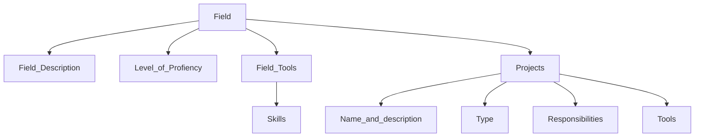

# Curriculum Vitae

The main idea of this project is to organize my experience and write it as code. It should help with inventory, self-development planning, and keeping stuff more under control.

It's reasonable to keep structure as:

It generates up-to-date CVs for different positions and places them in release.
